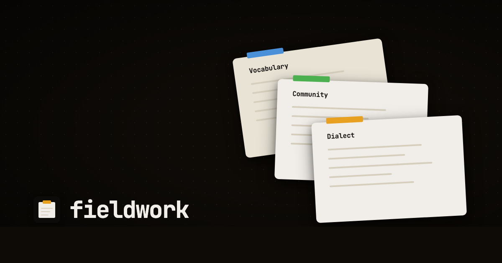

<p align="center">
  
</p>

# fieldwork

A workshop for community schema curation on atproto. Built on [idiolect].

fieldwork composes the records that govern how a community translates
between atproto schemas. Eight tools share a browser-local workspace.
The Community Workbench carries a governed change from intent through
review, release, migration, federation, and portable exit. Focused
editors compose dialects, vocabularies, communities, recommendations,
and deliberations against the `dev.idiolect.*` lexicon family, while
the lens library and lexicon browser make published infrastructure
inspectable. Drafts export as record JSON, copy as
`idiolect-cli` invocations, or publish straight to the active session
via atproto OAuth.

Live at **<https://idiolect.dev/fieldwork/>**

## Tools

Eight tools. Record editors work off the same in-memory **Workspace**
so an import in one tool feeds suggestions in the next; the Community
Workbench keeps its lifecycle history in a separately portable
community workspace.

| Tool                       | What it builds                                                                                       | Record kind        |
|----------------------------|------------------------------------------------------------------------------------------------------|--------------------|
| `Community Workbench`      | A governed release thread: change packets, reviews, signed releases, migration runs, federation declarations, and a complete exit bundle. | `dev.idiolect.{changeProposal,communityRelease,migrationRun,federation}` |
| `Dialect Composer`         | A dialect with preferred lenses, deprecations, and supersedes-chain.                                 | `dev.idiolect.dialect`        |
| `Vocabulary Editor`        | A typed multi-relation knowledge graph (OWL Lite property characteristics + SKOS Core annotations) or the legacy action / purpose tree. | `dev.idiolect.vocab`          |
| `Community Config`         | A community with members, role assignments, conventions, endorsements, core lens / schema sets, and record-hosting policy. | `dev.idiolect.community`      |
| `Recommendation Builder`   | A recommendation with a lens path, condition tree, and required-verifications block.                 | `dev.idiolect.recommendation` |
| `Deliberation Composer`    | A community-scoped question or proposal under collective consideration, plus statements and observer outcomes. | `dev.idiolect.deliberation{,Statement,Outcome}` |
| `Lens Manager`             | Lists your published lenses and uploads protolab-authored bodies to your PDS.                        | `dev.panproto.schema.lens`    |
| `Lexicon Browser`          | Read-only view of every bundled `dev.idiolect.*` lexicon plus user-imported docs.                    | (read-only)                   |

Every editor has the same import / export shape. Paste an at-uri,
drop a JSON file, or pick from the bundled fixtures. Export
downloads a JSON record body, copies an `idiolect-cli` publish
command, or publishes straight to your PDS via OAuth.

## Community Workbench

The workbench is the participant-facing surface for Idiolect 0.13's
community infrastructure. Its release thread has eight stops:

1. **Start here** defines the four concepts a newcomer needs and shows
   progress toward a first release.
2. **Community rules** records the accountable DID, decision model,
   quorum, approval threshold, release signature requirement, review
   period, and resource boundaries.
3. **Change packets** keep plain-language intent beside exact source
   and target definitions. Panproto 0.74.4 supplies the full schema
   diff, compatibility class, and migration optic. Fieldwork translates
   those results into effects participants can review.
4. **Review and decide** records attributable reviews and applies the
   community's policy. An incomplete verification is never treated as
   a passing result.
5. **Signed releases** collect approved changes and detached ES256
   signatures. The Idiolect CLI remains the reference signer and
   verifier.
6. **Migration runs** expose durable status, progress, checkpoints, and
   bounded failure information.
7. **Federation** declares peer relationships separately from the
   mappings that support actual semantic interoperability.
8. **Exit and export** downloads the complete workspace and inventory,
   or individual publishable protocol records.

### Progressive disclosure

The workbench uses four disclosure depths consistently:

- **Orient** gives a plain-language purpose, defines unfamiliar terms,
  and names one next action.
- **Act** shows only the fields needed to complete the present task.
- **Inspect** reveals policy limits, decision evidence, semantic
  mappings, and migration checkpoints in context.
- **Interoperate** reveals raw schema JSON, content digests, detached
  signatures, and protocol-record exports.

The first two depths are visible by default. Native HTML disclosure
rows expose the latter two, so keyboard and screen-reader users get the
same hierarchy without a separate expert-mode interface.

## Why static-only

idiolect is a federated record system. Everything fieldwork builds is
a record draft conforming to one of the `dev.idiolect.*` lexicons.
Publishing means appending the record to the user's PDS, which only
the user can authorise. Keeping fieldwork backend-free (static HTML +
CSS + JS + WASM, hostable on GitHub Pages) means:

- no fieldwork-operated server holds drafts or credentials.
- import / export works against any PDS the user can OAuth into.
- the tool is reproducible and forkable: clone, push to your own
  Pages, redirect a custom domain.

## Running it

### Hosted

<https://idiolect.dev/fieldwork/>

### Locally

Requires Rust 1.95+, Node 20+, and [wasm-pack].

```bash
git clone https://github.com/idiolect-dev/fieldwork
cd fieldwork
./scripts/build-wasm.sh     # builds the fieldwork-wasm crate
cd app && bun install && bun run dev
```

Rust changes need a rebuild of the WASM bundle (`./scripts/build-wasm.sh`).
The React layer hot-reloads.

## At-URI autocomplete

Every at-uri input understands handles. Type `aaron.bsky.social/...`,
pick a record from the live PDS listing, and fieldwork stores the
canonical at-uri internally. On serialise (export, publish), the
handle's repo segment resolves to a DID via bsky's public AppView so
the bytes that hit the network always carry stable identifiers,
even though the input shows the human-readable handle.

The autocomplete walks segments in order:

1. Handle / DID search across local sessions and bsky typeahead.
   When an `expectedCollection` is set, the active session's
   records of that kind appear at the top.
2. Collection segment, prefix-filtered against the bundled record
   NSIDs.
3. Rkey segment, live from the typed repo's PDS via
   `com.atproto.repo.listRecords`.

## Lexicon viewer

Six tabs over the active lexicon document:

- `JSON`: syntax-highlighted source.
- `Definitions`: table of every `def` entry with its type and description.
- `Fields`: per-def field tables, with refs and `array<ref>` and unions
  recursively expanded as indented child rows. Cycle-safe.
- `Refs`: a per-def "uses" / "used by" table. Clickable internal refs
  jump to the Fields tab and scroll to the target.
- `Diff`: pin a baseline version and surface added / removed / changed
  fields against it.
- `Try`: a copy-pasteable record body or curl-able request stub for
  the lexicon's `main` def, filled with placeholder values that
  substitute the active session's DID and PDS when signed in.

## OAuth scopes

fieldwork uses atproto's granular scope spec. Three intent tiers
are surfaced in the Sign-in menu:

| Intent       | Scopes                                                                              |
|--------------|-------------------------------------------------------------------------------------|
| `read-only`  | `atproto`                                                                           |
| `curator`    | `atproto repo:dev.idiolect.{dialect,vocab,community,recommendation,deliberation,deliberationStatement,deliberationOutcome,changeProposal,communityRelease,migrationRun,federation}` |
| `full`       | `atproto` + every `repo:dev.idiolect.*` collection Fieldwork understands             |

Once `dev.idiolect.auth.{curatorAccess,fullAccess}` permission-set
lexicons are published and resolvable, set
`VITE_USE_PERMISSION_SETS=true` at build time to switch to the
more-readable `include:` references.

## Layout

```text
crates/
  fieldwork-core/   record-draft model, validators, in-memory workspace
  fieldwork-wasm/   wasm-bindgen entry points the React app imports

app/
  src/
    tools/          one component tree per tool (DialectComposer, ...)
    infrastructure/ community workspace model, policy gate, Panproto consequence analysis, portable export
    workspace/      shared workspace state (zustand)
    sessions/       atproto OAuth client, scope tiers, publish + normalise helpers
    components/     AtUriAutocomplete, HandleSearch, GuidancePane, DiffPane, ImportButton, ExportButton, SessionMenu, Sidebar
    lexicons/       LexiconViewer + bundled dev.idiolect.* + dev.panproto.* JSON
    fixtures/       seed data for each tool
    panproto/       wasm init + lexicon validator
```

Each crate is a thin wrapper over [idiolect]. Most idiolect releases
land in fieldwork as a `Cargo.toml` tag bump.

## Tests

```bash
cargo test --workspace      # Rust
cd app && bun test          # frontend (vitest)
cd app && bun run typecheck # tsc --noEmit
```

## License

MIT. See [LICENSE](LICENSE).

## Related

- [idiolect]: lexicon family, codegen, record indexer, observer,
  orchestrator. fieldwork is the authoring surface on top.
- [protolab]: the visual lens editor. Export a lens here, upload it
  via fieldwork's Lens Manager.
- [panproto]: schemas, lenses, protolenses, the foundation under
  both idiolect and protolab.
- [atproto]: the protocol fieldwork's records publish into.

[idiolect]: https://github.com/idiolect-dev/idiolect
[protolab]: https://panproto.dev/protolab/
[panproto]: https://github.com/panproto/panproto
[atproto]: https://atproto.com/
[wasm-pack]: https://rustwasm.github.io/wasm-pack/installer/
